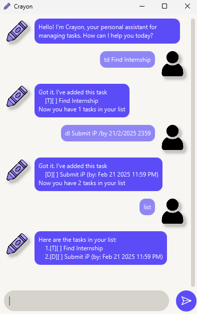

# Crayon User Guide


Meet **Crayon** – your lightning-fast, intuitive assistant designed to help you take control of your day. With a simple, command-based interface, Crayon makes task management effortless and efficient. Whether you're organizing your to-dos, scheduling tasks, or staying on top of deadlines, Crayon delivers smart, reliable solutions in an instant.

Built for speed and simplicity, Crayon empowers you to focus on what matters most – while it handles the rest.

- CLI-Based: Access tasks with ease from your terminal.
- Simple Commands: No complicated interfaces, just straightforward action.
- Lightning Fast: Get results faster than ever before.

Take productivity to the next level. Meet Crayon, and get things done.

## Get Started
All you need to do is,

1. Download it from [here](https://github.com/nja99/ip)
2. Start by double-clicking the App.
3. Add your Tasks.
4. Let **Crayon** do the rest for you! 😉

## Commands
 Command          | Prefixes           | Description                                    |
|-----------------|--------------------|------------------------------------------------|
| Add ToDo        | `todo`, `td`       | Add a new ToDo task to your list.              |
| Add Deadline    | `deadline`, `dl`   | Add a new Deadline task to your list.          |
| Add Event       | `event`,`e`        | Add a new Even task to your list.              |
| Mark as Done    | `mark`, `m`        | Mark a task as completed.                      |
| Mark as Undone  | `unmark`, `um`     | Mark a task as uncompleted.                    |
| Delete Task     | `delete`, `del`    | Delete a task from your list                   |
| List Task(s)    | `list`, `ls`       | Displays all your current tasks.               |
| Find Task(s)    | `find`, `f`        | Find a task that contains a specific `keyword` |
| Exit and Save   | `bye`, `exit`, `q` | Save all task and exit the program             |

### Adding ToDos
**Add a new ToDo task**

*Command Syntax:* `todo <task> | td <task>`

*Example:* `td Find an Internship`

*Expected Output:*
```
Got it! I have added this task
  [T][] Find an Internship
Now you have 1 task(s) in your list
```

### Adding Deadlines

**Add a new Deadline task**

*Command Syntax:* `deadline <task> /by <end_date> | dl <task>  /by <end_date>`

*Example:* `dl Submit iP /by 21/2/2025 2359`

*Expected Output:*
```
Got it! I have added this task
  [D][] Submit iP (by: Feb 21 2025 11:59 PM)
Now you have 1 task(s) in your list
```

### Adding Events

**Add a new Event task**

*Command Syntax:* `event <task> /from <start_date> /to <end_date | e <task> /from <start_date> /to <end_date>`

*Example:* `e Recess Week /from 24/2/2025 0000 /to 28/2/2025 2359`

*Expected Output:*
```
Got it! I have added this task
  [E][] Recess Week (from: Feb 24 2025 12:00 AM to: Feb 28 2025 11:59 PM)
Now you have 1 task(s) in your list
```

### List Task(s)
**Show a list of task(s)**

*Command Syntax:* `list | ls <type>`

*Example:* `ls todo`

*Expected Output:*
```
Here are the todo task(s) in your list
  [T][] Find Internship
Now you have 1 task(s) in your list
```

### Find Task(s)
**Show list of task(s) containing a specific `keyword`**

*Command Syntax* `find <keyword> | f <keyword>`

*Example:* `f iP`

*Expected Output:*
```
Here are the matching task(s) in your list
  [D][] Submit iP (by: Feb 21 2025 11:59 PM)
```

### Mark, Unmark, Delete Task(s)
**Mark, Unmark or Delete a task at a specified `index`.**

*Command Syntax:* 

Mark a Task: `mark <index> | m <index> `

Unmark a Task: `unmark <index> | um <index> `

Delete a Task: `delete <index> | del <index>`

Example: `m 1`

*Expected Output:*
```
Nice! I've marked this task as done
  [T][] Find Internship
```

### Exit Program
**Save all task and close the program**

*Command Syntax:* `bye | exit | q`

*Expected Output:*
```
Goodbye! It was nice chatting with you. Let me know if you need help with task(s) again!

The application will close in 3 seconds.
```

**Note: If you choose to close the program by pressing the X (window close button), all tasks will still be properly saved, just like when using the bye, exit, or q commands.**

## Features
### Save on Exit
**Automatically save your task(s) when exiting the program**

*Whether you use the bye, exit, or q command to close the program or press the X button to close the window, Crayon will automatically save all your task(s) locally before shutting down.*

*The next time you launch Crayon all your tasks are automatically reloaded so you can pick up right where you left off.*

### CSV Format for Import/Export
**Easily import and export tasks using CSV format**

*To enhance flexibility, Crayon stores your task(s) data in a CSV format. Making it easy for you to import and export your data.*

*Sharing and transferring data to other applications have never been easier*